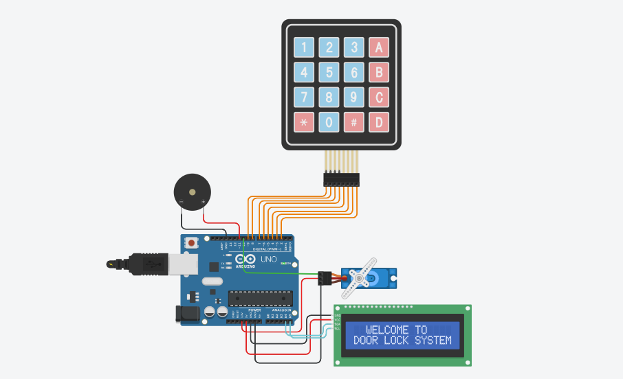
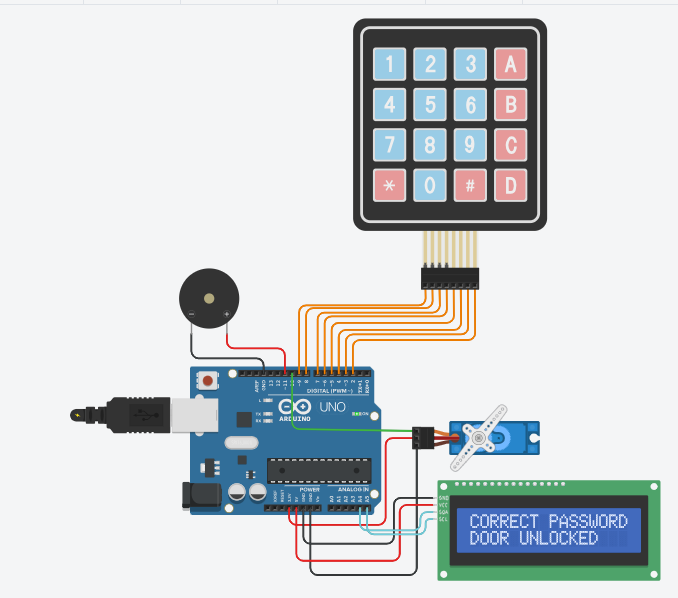
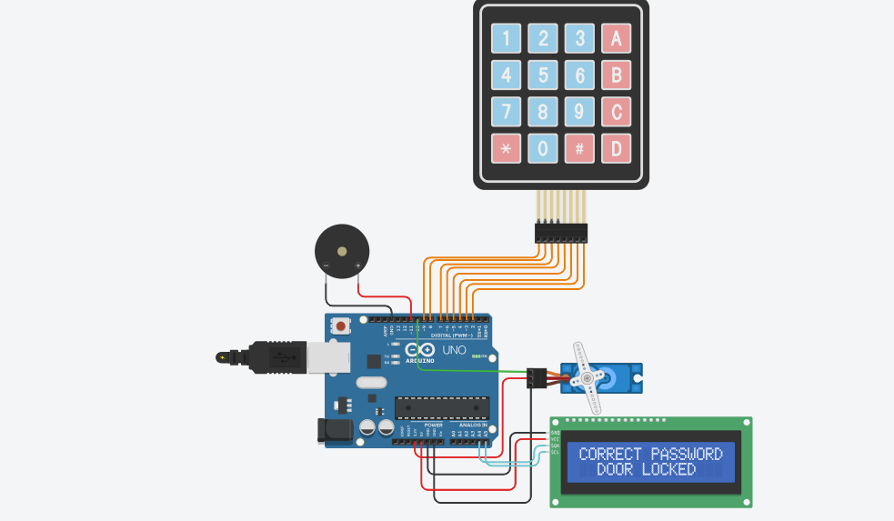

# 🔐 Arduino Password-Protected Door Lock System

## 📖 Overview

This project is an Arduino-based electronic door lock system that uses password authentication to control a servo motor acting as the locking mechanism.

The user enters a password through a 4×4 matrix keypad. The system verifies the entered password and provides feedback through a 16×2 I2C LCD and piezo buzzer while controlling the servo motor to lock or unlock the door.

The project was developed using Embedded C++ and simulated using Tinkercad.

---

## ✨ Features

- 🔐 Password authentication using a 4×4 matrix keypad
- 🔢 Password input masking using `*`
- 🔒 Servo-controlled locking mechanism
- 📺 16×2 I2C LCD user interface
- 🔊 Audio feedback using a piezo buzzer
- 🔄 Lock and unlock functionality
- 🧩 Modular Embedded C++ implementation
- 🧪 Simulation and system testing

---

## 🔧 Components Used

- Arduino Uno
- 4×4 Matrix Keypad
- Servo Motor
- 16×2 I2C LCD
- Piezo Buzzer
- Breadboard
- Jumper Wires

---

## 💻 Software

- Arduino IDE
- Embedded C++
- Tinkercad

---

## ⚙️ How It Works

1. The system initializes the servo motor, LCD, keypad, and buzzer.
2. The user enters the password using the 4×4 matrix keypad.
3. Entered characters are masked on the LCD using `*`.
4. After the required four characters are entered, the Arduino evaluates the password.
5. If the password is correct, the servo changes position to unlock or lock the door depending on its current state.
6. The LCD displays the authentication result and door status.
7. A short buzzer sound indicates successful authentication.
8. If the password is incorrect, the LCD displays an error message and the buzzer produces three error beeps.
9. The input is reset and the system waits for another password attempt.
---

## 🧩 Code Structure

### Password Class

The custom `Password` class handles:

- Storing the target password
- Resetting the current input
- Appending keypad characters
- Evaluating the entered password

### Door Control

The system uses dedicated functions to control the door:

- `unlockDoor()`
- `lockDoor()`

The servo motor is moved to predefined angles for the locked and unlocked states.

### User Feedback

The project provides feedback through:

- 16×2 I2C LCD
- Piezo buzzer
- Password masking

### Keypad Input

The `processKeyInput()` function handles keypad input and automatically evaluates the password once the required number of characters has been entered.

---

## 📷 Screenshots

### 🔌 Circuit Diagram

### 🔓 Door Unlocked

### 🔒 Door Locked

---

## 🧪 Simulation

The project was developed and tested through circuit simulation.

🔗  [View the Tinkercad Simulation](https://www.tinkercad.com/things/9U7bou2krwr-door-lock)

---

## 🧠 Skills Demonstrated

- Embedded Systems
- Embedded C++
- Arduino Programming
- Object-Oriented Programming
- Keypad Interfacing
- Servo Motor Control
- LCD Interfacing
- I2C Communication
- Digital I/O
- Hardware Integration
- System Testing

---

## 🚀 Future Improvements

- Password change functionality
- EEPROM password storage
- Multiple user passwords
- RFID authentication
- Fingerprint authentication
- Bluetooth or mobile control
- ESP32 implementation
- IoT integration
